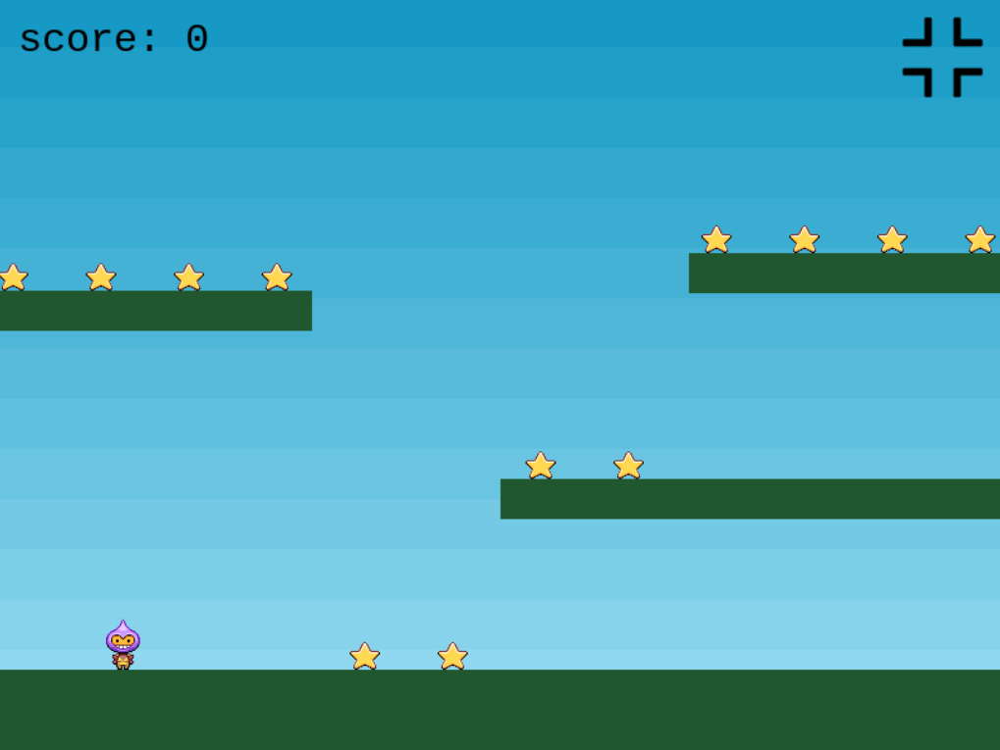

# Learning Phaser.js :video_game:

- Code from a little web graphic course for kids.

- It's a simple and interesting 2D game. Point of the game is to collect as many stars as you can, while bombs are chasing you.
It's harder than it looks like! :smirk:

- Most of the code I wrote following official Phaser.js tutorial: [https://phaser.io/tutorials/making-your-first-phaser-3-game/part1](https://phaser.io/tutorials/making-your-first-phaser-3-game/part1)

- To play the game you will need a runing web server (get something simple like Chrome Web Server).

